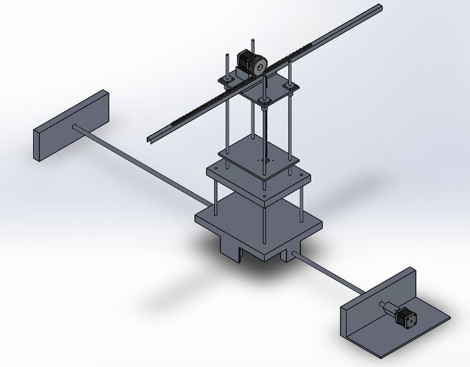
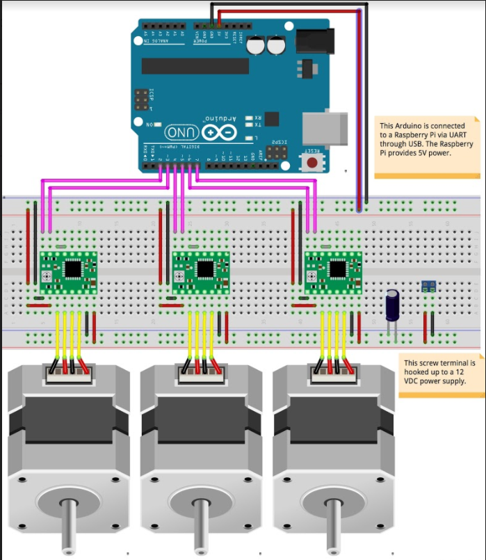
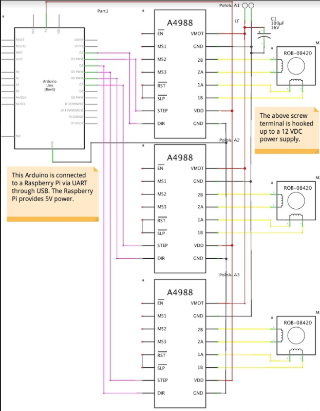

# Autonomous Car Charger
A electromechanical solution to autonomously plug in an electric car charger into the charge port.

## Motivation
In an increasingly modernized world, we try to automate as many menial tasks as possible to maximize our time. Most fully electric vehicles are seen as luxury cars and as such should be paired with luxury services. In countries such as Canada, it is often undesirable to leave the comfort of a vehicle during a snowstorm in order to manually plug in the car charger. An autonomous car charger would mitigate the need for the manual insertion of a car charger into the car charge port. Instead, the driver can sit patiently in the warmth of the car and simply wait for this operation to be performed for them.

## Implementation
### Mechanical Subsystem
A stationary model was chosen in order to reduce the weaknesses of a completely mobile solution. By creating a stationary device, the amount of space required is allocated by the dimensions of the mechanical struture. This will ensure that the environment will not affect the movement of the electromechanical device. 

Three separate rails are implemented to allow movement in three dimensions. A bottom rail moves the car charger along the length of the car. A central rail moves the car charger along the height of the car. Finally, the top rail holds the car charger and moves towards the body of the car in order to insert into the charge port. 

     
    <em>Figure 1: CAD of the Model</em>

### Electrical Subsystem
Three stepper motors are used for the three movement rails. An arduino controls all three motors. Remote control is achieved through bluetooth communication with the Arduino. Additionally, a Raspberry Pi is connected to the Arduino via UART communication to achieve autonomous movement. The motors are supplied by an external 12 VDC power supply. 

     
    <em>Figure 2: Breadboard Containing Electrical Components</em>  
     
    <em>Figure 3: Electrical Schematic</em>

### Software Subsystem
Python and C++ are used to control the Arduino and Raspberry Pi. OpenCV is used to achieve computer vision. A camera on the car charger feeds video to the raspberry pi which computes edge detection of the charge port in order to send commands to the arduino to move the motors accordingly. 